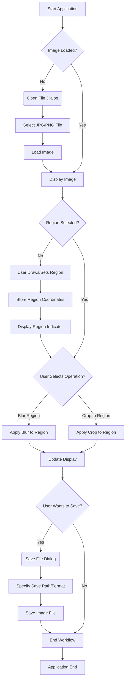

Okay, here is the system flow documentation for the Python+PIL+PyQt image processing application, formatted as requested in markdown.

```markdown
# Simple Image Processor Application System Flow Documentation

## 1. Document Header

*   **Version:** 1.0
*   **Date:** June 7, 2025

## 2. System Overview

This document outlines the system architecture and flows for a simple desktop application designed to open JPG and PNG image files, allow the user to select a region of interest, and perform basic image processing operations (blurring, cropping) on that selected region.

The application is built using Python, leveraging:
*   **PyQt:** For the graphical user interface (GUI).
*   **Pillow (PIL):** For image loading, manipulation, and saving.
*   **Standard Python Libraries:** For file system interaction and general logic.

The system is designed to be deployable as a standalone executable on Windows platforms (using tools like PyInstaller) and runnable as a standard Python script on Linux.

**Key Components:**

1.  **User Interface (UI) Layer (PyQt):** Handles all user interactions. Displays the image, provides controls (buttons, menus, sliders), manages user input for region selection (e.g., mouse events), and displays output/status messages.
2.  **Application Logic Layer (Python):** Acts as the intermediary between the UI and the image processing core. Manages the application state (e.g., current image, selected region), handles user commands from the UI, validates input, calls the appropriate image processing functions, and updates the UI with results.
3.  **Image Processing Core (Pillow/PIL):** Performs the actual image manipulation tasks. Provides functions for loading image files, accessing pixel data, applying filters (blur), cropping regions, and saving modified images.
4.  **File Handling Module (Python I/O):** Manages reading image data from the file system and writing modified image data back to the file system. Interacts with the operating system's file dialogs.

**Component Interactions:**

*   The **UI Layer** sends user actions (button clicks, menu selections, mouse events for region selection) to the **Application Logic Layer**.
*   The **Application Logic Layer** requests file operations from the **File Handling Module** (Open, Save) and image manipulations from the **Image Processing Core** (Load, Blur, Crop, Save).
*   The **File Handling Module** interacts with the file system.
*   The **Image Processing Core** performs operations on image data in memory.
*   The **Application Logic Layer** receives results (image data, status) from the **File Handling Module** and **Image Processing Core** and instructs the **UI Layer** to update its display.

## 3. User Workflows

The primary user journey involves opening an image, selecting a region, applying an operation, and potentially saving the result.

### Primary Workflow: Open, Process, Save

This workflow describes the typical steps a user takes to modify an image.

1.  **Launch Application:** The user starts the standalone executable (Windows) or runs the Python script (Linux).
2.  **Open Image:** The user selects the "Open" action (e.g., menu item, button).
    *   A file dialog is presented.
    *   The user selects a JPG or PNG file.
    *   The application loads the image.
    *   The image is displayed in the main UI area.
    *   Processing controls (Blur, Crop) become enabled.
3.  **Select Region:** The user interacts with the displayed image (e.g., click-and-drag with the mouse) to define a rectangular region of interest.
    *   A visual indicator of the selected region is displayed.
    *   The application stores the coordinates of the selected region.
    *   Processing controls requiring a region (Blur, Crop) are now fully enabled and ready for use.
4.  **Perform Operation (Blur/Crop):** The user selects either the "Blur Region" or "Crop to Region" action.
    *   The Application Logic uses the stored selected region coordinates and calls the appropriate function in the Image Processing Core.
    *   If Blur: The selected region is blurred.
    *   If Crop: The image is cropped to the boundaries of the selected region, and the display updates to show only the cropped part. (Note: Cropping changes image dimensions).
    *   The UI updates to show the modified image.
5.  **(Optional) Select New Region / Perform More Operations:** The user can select a new region and perform more operations on the current image.
6.  **Save Image:** The user selects the "Save" or "Save As" action.
    *   A file dialog is presented to choose the save location and format (e.g., JPG, PNG).
    *   The application saves the current state of the image to the specified file path using the File Handling Module and Image Processing Core.
7.  **Close Application:** The user closes the application window.



## 4. Data Flows

This section describes how key data moves between the system components during typical operations.

**Key Data Types:**

*   `File Path`: String representing the location of an image file on disk.
*   `Raw Image Data`: Bytes read directly from an image file.
*   `Image Object`: In-memory representation of an image, typically a Pillow `Image` object, containing pixel data, format, size, etc.
*   `Selection Coordinates`: Tuple or object storing the top-left and bottom-right coordinates (x1, y1, x2, y2) of the selected region.
*   `Processing Parameters`: Values like blur radius, etc.

**Data Flow Examples:**

1.  **Loading an Image:**
    *   `File Path` (from UI via dialog) -> `Application Logic`
    *   `File Path` -> `File Handling Module`
    *   `File Handling Module` reads `Raw Image Data` from `File System`.
    *   `Raw Image Data` -> `Image Processing Core` (via `File Handling Module` or `Application Logic`)
    *   `Image Processing Core` decodes `Raw Image Data` into `Image Object`.
    *   `Image Object` -> `Application Logic`
    *   `Image Object` (or display-ready version) -> `UI Layer` for display.

2.  **Selecting a Region:**
    *   Mouse/keyboard events -> `UI Layer`
    *   Raw input coordinates -> `Application Logic` (which translates screen coords to image coords)
    *   Calculated `Selection Coordinates` -> `Application Logic` (stored state)
    *   `Selection Coordinates` -> `UI Layer` (to draw the selection rectangle)

3.  **Applying Blur/Crop:**
    *   Operation Command + `Processing Parameters` (from UI) -> `Application Logic`
    *   Current `Image Object` (from state) + `Selection Coordinates` + `Processing Parameters` -> `Image Processing Core`
    *   `Image Processing Core` performs operation, returns Modified `Image Object`.
    *   Modified `Image Object` -> `Application Logic` (updates state)
    *   Modified `Image Object` (or display-ready version) -> `UI Layer` for display.

4.  **Saving an Image:**
    *   `File Path` (from UI via dialog) -> `Application Logic`
    *   Current `Image Object` (from state) -> `File Handling Module` (via `Application Logic`)
    *   `File Handling Module` (using `Image Processing Core`'s save capabilities) encodes `Image Object` into `Raw Image Data`.
    *   `Raw Image Data` -> `File System` (written by `File Handling Module`).

```mermaid
graph LR
    A[User Interaction <br> (UI)] --> B[Application Logic];
    B --> C[File Handling Module];
    B --> D[Image Processing Core];
    C --> E[File System];
    E --> C;
    D --> B;
    C --> B;

    subgraph Data Types
        F(File Path)
        G(Raw Image Data)
        H(Image Object)
        I(Selection Coordinates)
        J(Processing Parameters)
    end

    A -- F, I, J --> B;
    B -- F --> C;
    C -- G --> E;
    E -- G --> C;
    C -- G/H --> D;
    D -- H --> B;
    B -- H(display) --> A;
    B -- I --> A;

```

## 5. Error Handling

Robust error handling is crucial for a user-friendly application. Potential errors include issues with file I/O, invalid image data, or unexpected user input.

**Error Handling Strategies:**

1.  **File Operations:**
    *   **Potential Errors:** File Not Found, Permission Denied, Invalid File Format (during open), Disk Full, Invalid Path (during save).
    *   **Strategy:** Use Python's `try...except` blocks to catch `FileNotFoundError`, `PermissionError`, `IOError`, etc. Display informative error messages to the user using PyQt message boxes (`QMessageBox`). Prevent operations if no valid file is loaded.

2.  **Image Processing (Pillow):**
    *   **Potential Errors:** Corrupt image data, invalid parameters passed to Pillow functions (e.g., non-integer coordinates), unsupported image features.
    *   **Strategy:** Wrap Pillow calls in `try...except` blocks. Pillow can raise various exceptions (e.g., `IOError` for file issues, `ValueError` for bad parameters). Catch these, log them internally, and present a generic "Image processing failed" message to the user via a message box, possibly including specific details if helpful and safe.

3.  **User Input / Application State:**
    *   **Potential Errors:** User attempts processing without loading an image, user attempts region-specific operation without selecting a region, invalid input for processing parameters (if any).
    *   **Strategy:** Disable UI elements (buttons, menu items) when the corresponding action is not valid (e.g., disable Blur/Crop until an image is loaded and a region is selected). Validate input parameters before calling processing functions. Display warnings or information messages (`QMessageBox.information`, `QMessageBox.warning`) for non-critical issues (e.g., "Please select a region first").

4.  **General Application Errors:**
    *   **Potential Errors:** Unexpected exceptions within the PyQt event loop or application logic.
    *   **Strategy:** Implement a global exception hook in PyQt to catch unhandled exceptions. Log the traceback for debugging purposes (print to console for script, write to a log file for EXE). Display a critical error message to the user indicating an unexpected issue occurred and the application might need to close.

**Logging:** For the standalone EXE, consider setting up a simple file-based logging mechanism using Python's `logging` module to record errors and application events for debugging purposes.

## 6. Security Flows

For this specific application, which is a standalone desktop tool processing local files without network interaction, user accounts, or access to sensitive system resources beyond standard file read/write:

*   **Authentication:** No internal user authentication is required or implemented. Access to the application's functionality is granted to anyone running the application.
*   **Authorization:** No internal authorization is required or implemented. The application operates under the permissions of the logged-in operating system user. It cannot access files or directories that the user running the application does not have permission to access.

**Security Considerations primarily lie outside the application's scope:**

*   **Operating System File Permissions:** Security relies entirely on the underlying OS managing file access control.
*   **No Network Activity:** The application does not send or receive data over a network, removing a major attack vector.
*   **No External Dependencies (beyond core libraries):** Limiting external dependencies reduces the risk of vulnerabilities introduced by third-party code (Pillow and PyQt are widely used and generally considered robust for typical use cases).
*   **Input Validation:** While not a "security flow" in the traditional sense, validating image file formats and processing parameters helps prevent the application from crashing or behaving unexpectedly due to malicious or malformed input files.

In summary, this application does not require specific internal security flows like authentication or authorization because it operates locally on files the user already has access to. Its security posture is dependent on the security of the operating system it runs on.
```
