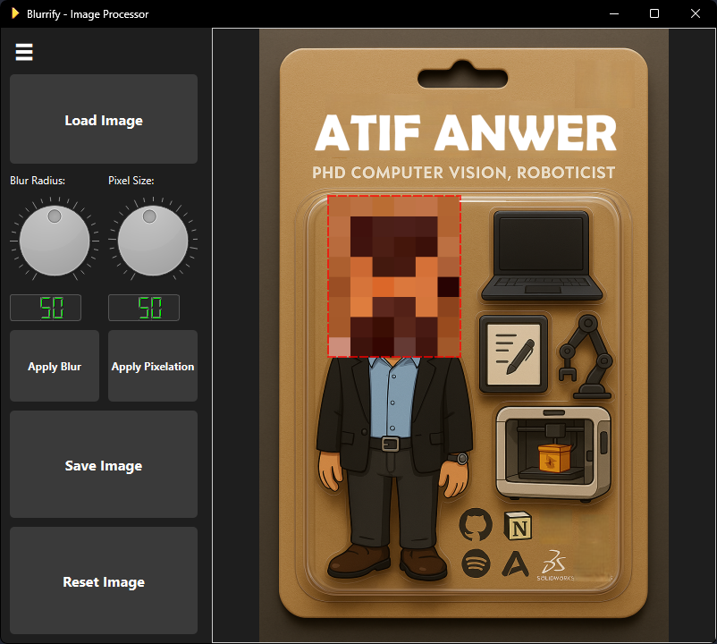

# Blurrify - Image Processing Application

A desktop application for blurring and pixelating selected image regions. Built with Python, PIL, and PyQt6.



## Features

- Open and view images (JPG, PNG)
- Apply Gaussian blur to selected regions
- Crop images
- Save processed images

## Installation

1. Clone the repository:
```bash
git clone https://github.com/yourusername/Blurrify.git
cd Blurrify
```

2. Create a virtual environment (recommended):
```bash
python -m venv venv
source venv/bin/activate  # On Windows: venv\Scripts\activate
```

3. Install dependencies:
```bash
pip install -r requirements.txt
```

## Usage

Run the application:
```bash
python src/main.py
```

## Development

- `src/` - Source code
  - `core/` - Core image processing logic
  - `gui/` - PyQt GUI implementation
  - `utils/` - Utility functions
- `tests/` - Test files
- `docs/` - Documentation

## License

This project is licensed under the MIT License - see the LICENSE file for details.
